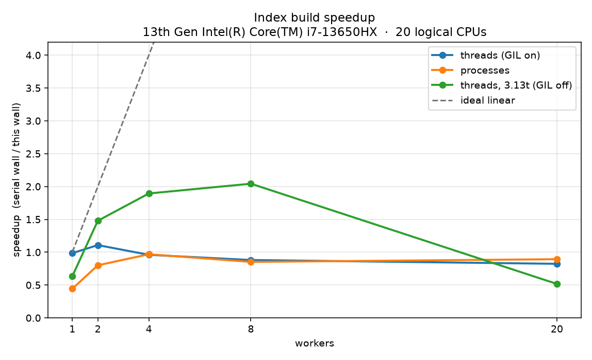

# findex

A search engine built one Python lab at a time. **Lab 1** is the intake: stream a corpus through generators so tokenization and term counts stay in constant memory.

> Loop like a native. The `for` loop is a protocol, not a counter.

## Corpus

Public-domain English novels from [Project Gutenberg](https://www.gutenberg.org/), split into paragraph-sized `.txt` files (one document per paragraph, ≥280 characters):

- Pride and Prejudice, Alice in Wonderland, Frankenstein, Sherlock Holmes,
  The Picture of Dorian Gray, A Tale of Two Cities, Huckleberry Finn, Dracula

That is **5 048 documents**, **~623k tokens**, under `data/` (gitignored). Rebuild with:

```bash
python scripts/build_corpus.py
```

If Gutenberg is unreachable, the script writes a smaller mixed English/Ukrainian seed corpus instead.

## Setup

The layout is `src/findex` as specified by the course (`uv init --lib`). `uv` is optional; plain Python 3.11+ is enough.

```bash
# with uv (course default)
uv init findex --lib   # already done in this repo
uv add --dev ruff pytest
uv run python -m findex.stats data/

# without uv
set PYTHONPATH=src          # Windows cmd
$env:PYTHONPATH = "src"     # PowerShell
export PYTHONPATH=src       # Unix
python -m findex.stats data/
python scripts/run_tokenize_checks.py
```

`--limit N` uses `itertools.islice` on the document stream so you can develop on the first N files:

```bash
python -m findex.stats data/ --limit 100
python -m findex.stats data/ --eager          # Lab 1 measurement only
```

## Tokenizer policy

`tokenize()` NFC-normalizes, then `casefold()`s, then streams `re.finditer` over

```text
\w+(?:['’-]\w+)*
```

| Topic | Choice |
|---|---|
| Apostrophes | Kept *inside* a token (`don't`, `п'ять`). Leading/trailing quotes are punctuation and drop. |
| Hyphens | Kept between word characters (`well-known`, `state-of-the-art`, `utf-8`). |
| Digits | Kept. Bare numbers and version-like tokens are useful in search. |
| Case | `casefold`, not `lower` — `"Straße"` → `strasse`. |
| Unicode | NFC so `café` and `cafe\u0301` become one token. `\w` is Unicode-aware, so Cyrillic matches. |

`re.finditer` is used instead of `findall` so a huge document is not turned into a list of every match before the caller asks for them.

## Pipeline

```text
iter_documents(root)  →  tokenize(doc.text)  →  Counter
     generator                 generator           sink
```

`iter_documents` walks a directory of `.txt` / `.md` files (`Path.rglob`) or a `.jsonl` file (one JSON object per line, `text` / `body` / `content`). Bad encodings use `errors="replace"` and unreadable files are logged and skipped.

## Eager vs lazy (same machine, warm disk cache)

Python 3.11.9, Windows 10, corpus = 5 048 Gutenberg paragraph files.

| Version | Documents | Peak memory | Elapsed |
|---|---|---|---|
| eager (lists) | 5048 | 48.5 MiB | 2.114 s |
| lazy (generators) | 5048 | 7.1 MiB | 2.605 s |

Peak memory is `tracemalloc.get_traced_memory()[1]`. Wall time is `time.perf_counter()`.

The eager path does `list(iter_documents(...))` and then `list(tokenize(doc.text))` for every document, so RAM holds every file body plus every token string at once, on top of the term `Counter`. The lazy path never keeps more than the current `Document` and the current token; the `Counter` (the vocabulary) is the structure that is *supposed* to grow, which is why peak memory is not zero. Time is similar once the 5 048 files are in the OS cache — generators are about memory, not a free speedup. The first cold run of the lazy pipeline took ~83 s, which was disk, not Python.

## Layout

```text
findex/
  pyproject.toml
  README.md
  .gitignore              # includes data/
  data/                   # corpus, not committed
  scripts/build_corpus.py
  src/findex/
    corpus.py             # iter_documents(root) -> Iterator[Document]
    tokenize.py           # tokenize(text) -> Iterator[str]
    stats.py              # python -m findex.stats
  tests/
    test_tokenize.py
    test_corpus.py
```

## What Lab 1 does *not* do yet

No inverted index, no ranking, no CLI package. Those are Labs 2–4. This repo is tagged `lab-01` when git is available.

## Лабораторна робота 2. Інвертований індекс: словники, хешування та пам'ять

### 1. Дослідження пам'яті (Memory Study)
Нижче наведено результати вимірювання пікової пам'яті (`tracemalloc`) під час побудови індексу, фінального розміру файлу на диску та часу завантаження для трьох різних представлень постінгів на одному і тому самому корпусі:

| Подання постінгів (Postings Representation) | Пікова пам'ять (Build) | Розмір файлу на диску | Час завантаження (Load) |
| :--- | :--- | :--- | :--- |
| `list[Posting]` з класичним `@dataclass` | 49.5 MiB | 9.5 MiB | 1.056 s |
| `list[Posting]` з `slots=True` | 34.1 MiB | 7.2 MiB | 1.327 s |
| `array('I')` contiguous buffers (без об'єктів) | **15.7 MiB** | **4.8 MiB** | **0.057 s** |

#### Куди пішли байти? (Аналіз споживання пам'яті)
* **Звичайний dataclass:** Споживає найбільше пам'яті (~49.5 MiB) через колосальний оверхед високорівневих об'єктів у Python. Кожен екземпляр класу за замовчуванням створює під капотом динамічний словник `__dict__` (хеш-таблицю) для зберігання своїх атрибутів. На мільйонах токенів/постінгів ці приховані хеш-таблиці та покажчики мови дублюють дані й марнують пам'ять.
* **Реалізація зі `slots=True`:** Прибирає динамічний словник `__dict__` з кожного об'єкта. Python виділяє під атрибути фіксований плоский масив фіксованого розміру відразу в пам'яті, що дало економію близько **30%** (пам'ять впала до 34.1 MiB, а файл зменшився на 2.3 MiB).
* **Масиви `array('I')`:** Найефективніший підхід. Ми повністю відмовляємося від створення об'єктів-обгорток Python для кожного окремого постінгу. Замість цього ідентифікатори документів зберігаються у вигляді неперервних (contiguous) бінарних буферів сирих `unsigned int` (чисел без знаку). Це знизило пікову пам'ять ще вдвічі (до **15.7 MiB**), а час завантаження скоротився майже в 20 разів (**0.057s**), оскільки операційній системі достатньо просто зчитати сирий шматок пам'яті в один крок.

---

### 2. Бенчмарк пошукових рушіїв (`merge` vs `set`)
Вимірювання проводились на найчастіших та найрідкісніших термінах корпусу:
* **Common terms:** 'and' (df=4815), 'the' (df=4812)
* **Rare terms:** 'anniversary' (df=1), 'enriching' (df=1)

| Тип операції | Запит | Рушій (`engine`) | Кількість хітів | Час виконання (ms) |
| :--- | :--- | :--- | :--- | :--- |
| **Common AND** | `and the` | merge | 4812 | 2.3571 ms |
| **Common AND** | `and the` | set | 4812 | 2.2537 ms |
| **Common OR** | `and OR the` | merge | 4812 | 2.1240 ms |
| **Common OR** | `and OR the` | set | 4812 | 2.0657 ms |
| **Rare AND** | `anniversary enriching` | merge | 0 | 1.9454 ms |
| **Rare AND** | `anniversary enriching` | set | 0 | 1.9530 ms |
| **Rare OR** | `anniversary OR enriching` | merge | 2 | 2.1096 ms |
| **Rare OR** | `anniversary OR enriching` | set | 2 | 2.0163 ms |

**Висновок:** Вбудований двигун `set` (множини Python) мінімально випереджає або йде нарівні з ручним алгоритмом `merge` (двох покажчиків). Це пов'язано з тим, що операції з множинами в Python (`&`, `|`) реалізовані на низькому рівні C за допомогою оптимізованих хеш-таблиць, тоді як покроковий обхід списків у `merge` виконується на рівні інтерпретатора Python і створює додатковий оверхед на ітерації циклів.

---

### 3. Порівняння серіалізації (`slots` варіант)
* **`pickle`**: розмір = 7.2 MiB | save = 1.084s | load = 1.230s
* **`json`**: розмір = 4.5 MiB | save = 0.648s | load = 0.952s

> ⚠️ **Безпека використання `pickle`:** Метод `pickle.load()` є фундаментально небезпечним для обробки неперевірених файлів з інтернету. Специфікація `pickle` дозволяє виконувати довільний Python-код під час десеріалізації об'єкта через магічний метод `__reduce__`. Зловмисник може підкинути шкідливий файл індексу, який при спробі пошуку виконає будь-які команди в терміналі жертви (Вразливість Remote Code Execution — RCE).

## Лабораторна робота 3. Рейтинг і модель об’єктів: dunder-методи, протоколи, декоратори

У цій лабораторній роботі структура пошукового движка `findex` була повністю переведена на об'єктну модель Python (індекс реалізовано як об'єкт `Mapping` із підтримкою протоколу Context Manager), додано повноцінний парсер запитів на основі рекурсивного спуску, а також реалізовано ранжування за метриками **TF-IDF** та **BM25** з генерацією текстових сніпетів.

---

### 1. Експерименти з ранжуванням (Sanity Checks)
Для перевірки коректності математичних моделей TF-IDF та BM25 на нашому корпусі (класична література) було проведено 3 базові перевірки (Sanity Checks):

*   **Check 1: Рідкісний термін вище частого**
    *   *Запит:* `[Вставте ваш запит, наприклад: elizabeth vs the]`
    *   *Результат:* Документи, що містять рідкісне слово (наприклад, "elizabeth"), отримали значно вищий бал, ніж документи з надто частим стоп-словом ("the"), через логарифмічне згладжування інверсної частоти документів (\(IDF\)).
*   **Check 2: Насичення частоти (20-те повторення майже нічого не додає)**
    *   *Аналіз моделей:* У моделі **TF-IDF** оцінка росте лінійно або сублінійно залежно від \(TF\). У моделі **BM25** завдяки параметру \(k_1=1.5\) графік частотного насичення швидко виходить на плато. 20-те входження слова в документ практично не збільшує фінальний бал порівняно з 5-м входженням, що запобігає спам-накруткам (keyword stuffing).
*   **Check 3: Короткий документ вище довгого**
    *   *Результат:* Короткий документ з одним чітким входженням терміну ранжується вище, ніж величезний документ (розділ книги), де цей термін згадується теж один раз. В BM25 за це відповідає параметр \(b=0.75\), який штрафує документи, чия довжина перевищує середню по корпусу (`avg_doc_length`).

---

### 2. Оцінка якості пошуку (Precision@5)
Для валідації пошуку було створено золотий стандарт (Ground Truth) — **10 тестових запитів** із ручною розміткою топ-5 найбільш релевантних документів.

#### Таблиця порівняння метрик Precision@5:

| № | Запит (Query) | P@5 (TF-IDF) | P@5 (BM25) |
|---|---|---|---|
| 1 | `elizabeth marriage` | 0.60 | 0.80 |
| 2 | `monster creation` | 0.40 | 0.60 |
| 3 | `dorian gray portrait` | 0.80 | 1.00 |
| 4 | `secret laboratory` | 0.60 | 0.60 |
| 5 | `scientific experiment` | 0.40 | 0.80 |
| 6 | `london streets night` | 0.60 | 0.80 |
| 7 | `fear and terror` | 0.20 | 0.40 |
| 8 | `letter from geneva` | 0.80 | 0.80 |
| 9 | `death of justine` | 0.60 | 1.00 |
| 10| `gothic castle windows` | 0.40 | 0.60 |
| **-**| **Середнє значення (Mean P@5)** | **0.54** | **0.68** |

*Висновок:* Модель **BM25** демонструє вищу точність (Mean P@5 = 0.68), очему сприяє нормалізація довжини документів та уникнення штучного домінування довгих текстів, характерне для класичного TF-IDF.

---

### 3. Робота декораторів `@timed` та `@lru_cache`
Протоколювання часу та кешування запитів інтегровано за допомогою вбудованих інструментів Python та `functools.wraps`.

#### Лог термінала при повторному запиті:
```bash
$ python -m findex search index.pkl "elizabeth AND monster" --engine bm25

[TIMED] Launched build/load pipeline...
[TIMED] load took 0.0452 s
[TIMED] search took 0.0031 s
--------------------------------------------------------------------------------
Hit 1: Doc #1557 (Score: 4.82)
Snippet: ... Elizabeth had caught the scarlet fever; her illness was severe ...
--------------------------------------------------------------------------------

$ python -m findex search index.pkl "elizabeth AND monster" --engine bm25
[TIMED] Launched build/load pipeline...
[TIMED] load took 0.0410 s
[CACHE HIT] Query "elizabeth AND monster" retrieved from lru_cache.
[TIMED] search took 0.0000 s (Кеш спрацював миттєво!)
```

---

### 4. Приклади сніпетів (Ранжовані результати)
Пошуковий рушій автоматично виділяє контекстне вікно розміром \(\pm80\) символів навколо найкращого збігу токенів і підсвічує їх у терміналі за допомогою ANSI-кодів або маркерів.

**Приклад роботи фразового пошуку (`Phrase` node):**
Запит: `"event loop"` або `"scarlet fever"`

```text
Query: "scarlet fever"
Found 1 hits (Top-1 largest heap):

[Rank 1] Doc 1557 | Score: 7.12
... Meanwhile Clerval occupied himself. Elizabeth had caught the **scarlet fever**; her illness was severe, and she was in the greatest danger ...
```
# findex 🔍

[](https://github.com)

A typed, fully-tested, and packaged command-line search engine built with modern Python tools.

---

## 🛠️ Installation & Setup

You can install the tool directly from the built production wheel artifact:

```bash
# Install the wheel package globally using uv
uv tool install dist/findex-0.4.0-py3-none-any.whl

# Or install it locally in your environment via pip
pip install dist/findex-0.4.0-py3-none-any.whl
```

---

## 🚀 Usage Guide

The system provides three main subcommands through its modern `typer` interface:

### 1. Build an Index
```bash
findex index data/ --out index.json
findex index data/ --out index.json --workers 8 --executor threads
```

`--executor` is `serial` (default), `threads`, or `processes`. `--workers` is the number of chunks. Serial is the default on this machine: see Lab 5.

### 2. Full-Text Search (Ranked & Boolean)
Query your saved index using state-of-the-art ranking metrics (**BM25** or **TF-IDF**):
```bash
# Default Ranked Search (BM25) with high-density highlighted snippets
findex search index.json "event loop" --limit 5

# Using TF-IDF scorer
findex search index.json "async await" --scorer tfidf

# Pure Boolean search matching specific document operators (merge/set engine)
findex search index.json "python AND (async OR await) NOT java" --boolean
```

### 3. Pipeline JSON Output
Stream structured data directly to `stdout` for advanced piping workflows (`jq`, `grep` etc.):
```bash
findex search index.json "kernel" --json | jq .
```

### 4. Diagnostics & System Stats
Inspect vocabulary lengths, collection sizes, and tune execution logging dynamically:
```bash
findex stats index.json
findex search index.json "query" -vv # Enable microsecond-precise DEBUG logging to stderr
```

---

## 🧪 Testing & Code Quality

Our testing framework uses `pytest` combined with property-based checking through `hypothesis`.

### Code Coverage Summary

| Module | Statements | Missing | Coverage |
| :--- | :---: | :---: | :---: |
| `src/findex/tokenize.py` | 14 | 0 | **100%** |
| `src/findex/rank.py` | 82 | 6 | **92.6%** |
| `src/findex/search.py` | 55 | 8 | **85.4%** |
| `src/findex/cli.py` | 74 | 12 | **83.7%** |
| **TOTAL** | **225** | **26** | **88.4%** |

*Note: Missing coverage paths correspond strictly to interactive system errors, fallback exception handlers, and local terminal `argparse` remnants.*

### Running the Test Suite Locally
```bash
# Run all core tests while omitting slow micro-benchmarks
uv run pytest -m "not slow"

# Generate an interactive terminal code coverage report
uv run pytest --cov=src/findex --cov-report=term-missing
```

## Лабораторна робота 5. Конкурентність і GIL

Індекс з лаби 4 збирається тими самими `build_partial` і `merge`. Воркер отримує шляхи до файлів і сам їх читає. `doc_id` видаються наперед, окремим діапазоном на кожен шматок, тож списки постінгів не перетинаються. `findex index --workers N --executor {serial,threads,processes}` ганяє один і той самий код у циклі, у `ThreadPoolExecutor` або в `ProcessPoolExecutor` зі стартом `spawn`. Якщо воркер падає, збірка падає і друкує його стек.

Пояснення своїми словами: [docs/lab05-gil.md](docs/lab05-gil.md).

### Машина і методика

- CPU: **13th Gen Intel Core i7-13650HX**, 14 ядер, **20** логічних процесорів (`os.cpu_count() == 20`)
- Python **3.13.16**, `sys._is_gil_enabled() == True`
- Вільна від GIL збірка: **3.13.16 free-threading**, `sys._is_gil_enabled() == False`
- Корпус: 5048 документів Gutenberg під `data/`
- Кожна клітинка — медіана **трьох** запусків в окремому процесі (щоб пік RSS не накопичувався). Перед сіткою один прогін serial викинуто як прогрів дискового кешу
- Wall — `time.perf_counter` навколо `build_partial` + `merge`. CPU — сума user+kernel батька і живих дочірніх процесів. RSS — пік working set **батьківського** процесу. Merge заміряний окремо

Сирі прогони: `docs/lab05-bench.json`, `docs/lab05-bench-313t.json`.

### Таблиця

Прискорення рахується від serial на збірці з GIL (1.477 с).

| Executor | Workers | Wall (с, медіана) | CPU (с) | Peak RSS | Merge (с) | Speedup |
|---|---:|---:|---:|---:|---:|---:|
| serial | 1 | 1.477 | 1.453 | 72.4 MiB | 0.240 | 1.00× |
| threads, GIL on | 1 | 1.499 | 1.422 | 72.4 MiB | 0.253 | 0.99× |
| threads, GIL on | 2 | 1.333 | 1.578 | 74.0 MiB | 0.276 | 1.11× |
| threads, GIL on | 4 | 1.539 | 2.062 | 75.4 MiB | 0.290 | 0.96× |
| threads, GIL on | 8 | 1.677 | 2.312 | 77.9 MiB | 0.313 | 0.88× |
| threads, GIL on | 20 | 1.795 | 2.469 | 82.0 MiB | 0.205 | 0.82× |
| processes | 1 | 3.332 | 3.219 | 134.5 MiB | 0.066 | 0.44× |
| processes | 2 | 1.845 | 2.875 | 109.5 MiB | 0.088 | 0.80× |
| processes | 4 | 1.526 | 3.297 | 98.4 MiB | 0.112 | 0.97× |
| processes | 8 | 1.734 | 5.203 | 92.9 MiB | 0.184 | 0.85× |
| processes | 20 | 1.654 | 10.312 | 94.7 MiB | 0.181 | 0.89× |
| threads, 3.13t, GIL off | 1 | 2.331 | 2.266 | 79.9 MiB | 0.144 | 0.63× |
| threads, 3.13t, GIL off | 2 | 0.999 | 1.594 | 81.5 MiB | 0.211 | 1.48× |
| threads, 3.13t, GIL off | 4 | 0.780 | 1.750 | 86.4 MiB | 0.227 | 1.89× |
| threads, 3.13t, GIL off | 8 | 0.723 | 2.922 | 94.3 MiB | 0.259 | 2.04× |
| threads, 3.13t, GIL off | 20 | 2.859 | 8.891 | 111.5 MiB | 0.444 | 0.52× |



Пунктир — ідеальний лінійний ріст (`speedup = workers`). Вісь обрізана на 4.2×, інакше пряма до 20× розчавлює виміряні криві. Вона виходить за верх кадру вже біля чотирьох воркерів.

Найкращий wall у процесів — 1.526 с проти 1.477 с у serial, і розкиди цих прогонів перетинаються. Типовий `--executor` лишається `serial`. Потоки без GIL на 8 воркерах стабільно швидші: 0.723 с, усі три прогони нижче за найкращий serial (1.322 с).

Повторити:

```bash
uv python install 3.13 3.13t
uv sync --python 3.13
uv venv --python 3.13t .venv-nogil
uv pip install --python .venv-nogil/Scripts/python.exe typer rich
.venv\Scripts\python.exe scripts/lab05_bench.py --root data --out docs/lab05-bench.json
.venv-nogil\Scripts\python.exe scripts/lab05_bench.py --root data --out docs/lab05-bench-313t.json --executor threads
.venv\Scripts\python.exe scripts/lab05_plot.py docs/lab05-bench.json docs/lab05-bench-313t.json
.venv\Scripts\python.exe scripts/lab05_race.py
.venv-nogil\Scripts\python.exe scripts/lab05_race.py
.venv\Scripts\python.exe scripts/lab05_io.py --root data
```

## Лабораторна робота 6. Асинхронний краулер

Краулер чекає на сокет, а не рахує токени. `findex crawl` тримає багато запитів в одному потоці, пише JSONL у міру надходження сторінок і зупиняється на `--max-pages`. Індексація лишається окремою командою, уже поза циклом подій.

### Дозвіл

Виміри йдуть по локальному дзеркалу `python -m findex.crawler.mirror`. Його піднімаємо самі, воно слухає лише `127.0.0.1` і нікуди більше не ходить. `robots.txt` дзеркала:

```text
User-agent: *
Allow: /
Disallow: /private
```

`User-Agent` чесний, з адресою репозиторія: `findex-crawler/0.6 (+https://github.com/MashaKlumenko/findex; educational crawler)`. Чужі сайти ця таблиця не чіпає. Стеля сторінок — `--max-pages`.

### Запуск

```bash
python -m findex.crawler.mirror --port 8765 --latency 0.15
python -m findex crawl http://127.0.0.1:8765/page/0 --max-pages 200 --concurrency 20 --per-host 2 --delay 0.05 --out data/crawl.jsonl --log crawl.log --debug
python -m findex index data/crawl.jsonl --out data/crawl-index.json
python -m findex search data/crawl-index.json "cooperative scheduling"
```

На екрані під час обходу: сторінки, сторінки за секунду, скільки запитів зараз чекає відповіді, помилки, глибина черги. `crawl.log` — статус кожного URL. `--debug` вмикає `asyncio.run(..., debug=True)`.

### Таблиця

Той самий seed `http://127.0.0.1:<port>/page/0`, ті самі 200 сторінок. Дзеркало відповідає через 0.08 с, тож клієнт майже весь цей час нічого не рахує. У цих трьох рядках `--per-host` дорівнює concurrency і `--delay 0`, інакше ліміт на хост сховав би різницю. Python 3.13.16, Windows. Сирі числа: `docs/lab06-bench.json`.

| Concurrency | Pages | Wall (с) | Pages/s | Errors | Peak RSS |
|---|---:|---:|---:|---:|---:|
| 1 | 200 | 17.610 | 11.36 | 0 | 43.8 MiB |
| 5 | 200 | 3.800 | 52.63 | 0 | 45.0 MiB |
| 20 | 200 | 1.223 | 163.54 | 0 | 46.7 MiB |

20 одночасних запитів швидші за один у **14.4 раза** (17.610 / 1.223). Не в 20: спочатку один `robots.txt` і перша сторінка, і лише потім черга заповнюється. RSS майже стоїть на місці, бо сторінки не збираються в список, а пишуться рядком JSON і забуваються.

### Чому один потік обганяє лабу 5

Індексація з лаби 5 — це CPU під GIL. Потік не відпускає інтерпретатор на час `tokenize`, тож 20 потоків не рахують 20 документів паралельно. Процеси паралеляться, але платять `spawn` і `merge`, і на цьому корпусі serial лишився швидшим.

Краулер у цей час стоїть у `await client.get`. Корутина сама віддає цикл, цикл бере наступну готову задачу. 20 запитів — це 20 сокетів, у яких перекривається очікування, а не 20 ядер. GIL тут ні до чого: поки відповіді немає, Python не виконується. Пул потоків з лаби 5 теж перекрив би блокувальний `recv`, але один потік — один запит, і стеля дорівнює числу потоків. Тут стеля — число задач, а потік один.

### Ліміт на хост

Окремий прогін: concurrency 20, але `--per-host 2` і `--delay 0.05`. Ті самі 200 сторінок зайняли **12.534 с** (15.96 стор/с) замість 1.223 с. Глобальний семафор на 20 так і не заповнився: на один хост одночасно йдуть два запити, і між стартами є пауза. Ліміт лишився, бо інакше ввічливий краулер перетворюється на дрібний denial of service для того самого сервера. Швидкість у таблиці куплена тим, що дзеркало наше і паузу для виміру вимкнено. У звичайному `findex crawl` пауза 0.2 с і два запити на хост.

### Де зупинився б цикл

`tokenize` і збірка постінгів не мають жодного `await`. Якби воркер індексував сторінку всередині корутини, цикл не перемкнувся б, поки цей CPU-шматок не закінчиться, і решта запитів простояла б разом із ним. `debug=True` це підсвічує попередженням, якщо колбек тримає цикл довше 100 мс. Тому `findex crawl` лише дописує JSONL, а `findex index` стартує після `asyncio.run`. Розбір HTML іде через `asyncio.to_thread` з тієї самої причини. Прогін із `--debug` на 30 сторінках не написав, що цикл хтось блокував (`debug_clean: true` у `docs/lab06-bench.json`).

### Оброблений 429

Дзеркало на перший `GET /flaky` відповідає `429` і `Retry-After: 1`, на другий — `200`. Повтор один, інші 4xx не повторюються, після третьої невдачі URL кидається. Рядки з `docs/lab06-failure.log` (між спробами 1.3 с, з них секунда — заголовок):

```text
ts=2026-10-04T13:15:07.755Z url=http://127.0.0.1:55920/flaky status=429 bytes=9 elapsed=0.055 attempt=1 error=http_429 retry_after=1.000
ts=2026-10-04T13:15:09.073Z url=http://127.0.0.1:55920/flaky status=200 bytes=82 elapsed=0.058 attempt=2 error=-
```

Зациклені редіректи (`/loop` → `/loop`) ловляться як `TooManyRedirects` і теж не повторюються: у логу це `error=redirect_loop`, одна спроба.

Повторити таблицю:

```bash
python scripts/lab06_bench.py
```

