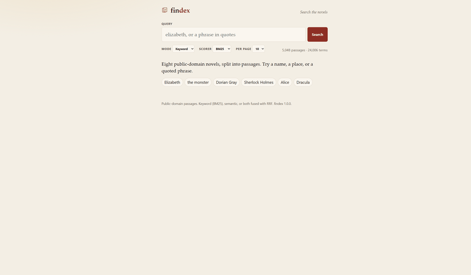
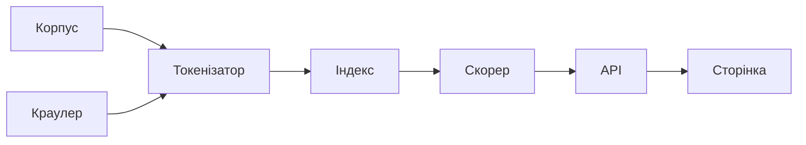

# findex

Пошук по абзацах восьми романів Project Gutenberg: слова (BM25), зміст уривка (ембединги) або обидва списки, злиті через Reciprocal Rank Fusion.

**Жива сторінка:** [findex-fur3.onrender.com](https://findex-fur3.onrender.com) — версія на Render оновлюється з цього репозиторія. У образі запечений демонстраційний індекс на 800 уривків, тож семантичний режим там відповідає 400, доки поруч немає матриці ембедингів. Повний корпус і всі три режими — локально, командами нижче.



| Корпус | p95 | Найбільше прискорення |
|---|---|---|
| **5 048** уривків, 24 006 термінів, 623 261 токен | **211 мс** — 4 воркери, запит `elizabeth`, oha, повний індекс | **16×** — BM25 терміна `the` (4 812 документи) після NumPy |

p95 — це черга навантажувального тесту з лаби 7, не час однієї формули. На самому Render той самий запит має p95 **1.7 с**: це мережа і безплатний інстанс, у сторінки ранжування лишається одиниці мілісекунд.

## Шлях даних



Файли Gutenberg читаються як корпус. Краулер пише JSONL, і той самий токенізатор індексує його. Далі індекс, BM25 або косинус, HTTP і сторінка.

| Крок | Де | Що виходить |
|---|---|---|
| Корпус | `data/gutenberg`, `scripts/build_corpus.py` | 5 048 абзаців, кожен файл — один документ |
| Краулер | `findex crawl` | JSONL; 20 одночасних запитів до локального дзеркала — 164 стор/с |
| Токенізатор | `tokenize` | NFC, `casefold`, `\w+(?:['’-]\w+)*` |
| Індекс | `findex index` | постінги; `array('I')` вантажиться за 0.057 с проти 1.3 с у об’єктів |
| Скорер | BM25 / TF-IDF, NumPy | терм `the`: 3.55 мс → 0.22 мс |
| API | `GET /search` | `mode=keyword\|semantic\|hybrid` |
| Сторінка | `GET /` | той самий запит, htmx, уривок за `/doc/{id}` |

## Запуск

Python 3.12+. Залежності ставить `uv sync` або `pip install -e .`.

```bash
findex index data/gutenberg --out data/index.pkl
findex embed data/index.pkl --out data/embeddings
findex serve --index data/index.pkl --embeddings data/embeddings
findex search data/index.pkl "elizabeth darcy" --mode hybrid --embeddings data/embeddings
```

`findex embed` ріже документ на фрагменти приблизно по 256 токенів із перекриттям 32, рахує [all-MiniLM-L6-v2](https://huggingface.co/sentence-transformers/all-MiniLM-L6-v2) через ONNX (fastembed), ділить кожен вектор на його довжину і пише `vectors.npy`. На цій машині колесо PyTorch не завантажує `shm.dll`, тож семантичний шлях — ONNX, не `sentence-transformers`.

Пробіл у запиті — це AND. `OR`, `NOT` і лапки для фрази працюють; фраза потребує індексу, зібраного з `--positions`.

## Лаба 8. Профіль, NumPy, семантичний пошук

Профіль знятий **до** заміни скорера. Полум’я: [docs/flame-search.svg](docs/flame-search.svg), [docs/flame-index.svg](docs/flame-index.svg). Запис гіпотез: [docs/lab08-profile.md](docs/lab08-profile.md).

Один виклик `findex search` на повному індексі — це не BM25. Без профілювальника завантаження pickle тривало **3.31 с**, а запит `elizabeth darcy marriage` — **0.0005 с**. cProfile обгорнутий у `tracemalloc` роздув те саме завантаження до 12.9 с: порядок функцій лишився, абсолютні секунди — ні.

| Місце | Де | Python чи нативний код | Гіпотеза до правок |
|---|---|---|---|
| 1 | `pickle.load` 409 457 об’єктів `Posting` | нативний pickle і Python-колбек на кожен dataclass | час іде на відновлення об’єктів, не на байти |
| 2 | `BM25.score` у циклі по постінгах | Scalene малює рядок нативним, бо кожна ітерація кличе `math.log` | цикл Python навколо цих викликів і є те, що замінює один ufunc |
| 3 | `iter_postings` збирає `Posting` | Python-об’єкт на кожен постінг | `int32` прибирає цей `yield` із гарячого шляху |

Постінги для скорера — два масиви `int32` (id документа і число входжень), довжини документів — один масив `int32`. BM25 і TF-IDF — вирази над масивами, топ-k — `np.argpartition`. Порядок документів збігається з лабою 3 (тест `tests/test_numpy_rank.py`). Подання на диску лишилося `slots`, щоб старі тести pickle не змінили байтів; масив будується під час першого запиту і кешується.

| Запит | Документів | Лаба 3, мс | NumPy, мс | Прискорення |
|---|---:|---:|---:|---:|
| `the` | 4812 | 3.549 | 0.221 | 16.0× |
| `anniversary` | 1 | 0.007 | 0.024 | 0.30× |
| `elizabeth darcy marriage` | 8 | 0.046 | 0.071 | 0.65× |

Медіана дев’яти викликів після одного прогріву, сніпети вимкнені, `python scripts/lab08_bench.py`. На частому терміні виграш — це зниклі виклики Python на кожен із 4 812 постінгів. На одному документі і на AND із восьми документів список коротший за накладні витрати маски й `argpartition`, тож NumPy повільніший. Це не провал формули, це ціна виклику на короткому списку.

`pytest-benchmark` на `search` і `build_index` стоїть окремим кроком CI (`.github/workflows/ci.yml`, без `|| true`). Решта лінтера і тестів у цьому репозиторії досі не валить збірку: так було до лаби 8.

### Precision@5

Десять запитів лаби 3 плюс п’ять перефразів. Влучення — уривок із тієї книжки, яка вказана в мітці (slug у шляху файлу), не ручний список абзаців. Скрипт: `python scripts/lab08_eval.py`. Модель: all-MiniLM-L6-v2, 5 425 фрагментів.

| Вид | Запит | Keyword | Semantic | Hybrid |
|---|---|---:|---:|---:|
| лексичний | `elizabeth darcy` | 1.00 | 1.00 | 1.00 |
| лексичний | `white rabbit` | 1.00 | 1.00 | 1.00 |
| лексичний | `sherlock holmes` | 1.00 | 1.00 | 1.00 |
| лексичний | `"dorian gray"` | 1.00 | 1.00 | 1.00 |
| лексичний | `frankenstein creature` | 0.60 | 1.00 | 1.00 |
| лексичний | `huckleberry finn` | 0.00 | 1.00 | 1.00 |
| лексичний | `"best of times"` | 0.40 | 0.40 | 0.40 |
| лексичний | `jonathan harker` | 1.00 | 1.00 | 1.00 |
| лексичний | `baskerville` | 0.00 | 0.40 | 0.40 |
| лексичний | `mad hatter` | 0.20 | 0.80 | 0.80 |
| перефраз | `a proud young woman and a reserved gentleman` | 0.00 | 0.40 | 0.40 |
| перефраз | `a child tumbles into a strange underground tea party` | 0.00 | 0.00 | 0.00 |
| перефраз | `a consulting detective shares rooms with a doctor` | 0.00 | 0.60 | 0.60 |
| перефраз | `a student assembles a living body and abandons it` | 0.00 | 0.20 | 0.20 |
| перефраз | `a painted portrait ages while the sitter stays young` | 0.00 | 1.00 | 1.00 |
| | **середнє** | **0.41** | **0.72** | **0.72** |

Імена, які є в індексі (`elizabeth`, `sherlock holmes`, `dorian gray`, `jonathan harker`), BM25 уже ставить у потрібну книжку, і ембединг це не псує. `huckleberry` зустрічається у 2 документах, `finn` у 4, разом — у жодному, тож AND дає порожній список і keyword P@5 = 0; семантичний запит усе одно збирає top-5 із цієї книжки. Токена `baskerville` у корпусі немає (df = 0): «Собака Баскервілів» у ці абзаци не ввійшла, BM25 мовчить, ембединг кладе в top-5 два уривки з тому про Холмса. Усі п’ять перефразів написані без імен книжок, і keyword на них нуль. Семантичний пошук повністю піднімає портрет, що старіє, частково — детектива з лікарем, і не піднімає чаювання під землею: MiniLM не з’єднує цей перефраз із Алісою без її слів. Hybrid на кожному рядку збігся з semantic. На перефразах список BM25 порожній або не про ту книжку, тож RRF (k = 60, глибина 200) повторює семантичний порядок. Там, де обидва списки вже тримають потрібну книжку в top-5, злиття precision@5 не змінює.

## Зведені виміри, лаби 1–7

Машина лаб 5–8: Windows, Intel Core i7-13650HX, 20 логічних процесорів, Python 3.13.16, GIL увімкнений, якщо не написано інше. Лаба 1 мірялась на Python 3.11.9.

### Лаба 1. Генератори

5 048 файлів, теплий дисковий кеш. Пік — `tracemalloc`.

| Версія | Документи | Пік пам’яті | Час |
|---|---:|---:|---:|
| eager (списки) | 5048 | 48.5 MiB | 2.114 с |
| lazy (генератори) | 5048 | 7.1 MiB | 2.605 с |

Час близький: генератори економлять пам’ять, не прискорюють теплий диск. Холодний перший прогін lazy був близько 83 с, і це був диск.

Токенізатор: апостроф і дефіс лишаються всередині слова (`don't`, `well-known`), регістр через `casefold` (`Straße` → `strasse`), NFC, `\w` бачить кирилицю. `finditer`, не `findall`.

### Лаба 2. Подання постінгів

| Подання | Пік на збірці | Файл | Завантаження |
|---|---:|---:|---:|
| `list[Posting]`, звичайний dataclass | 49.5 MiB | 9.5 MiB | 1.056 с |
| `list[Posting]`, `slots=True` | 34.1 MiB | 7.2 MiB | 1.327 с |
| `array('I')` | **15.7 MiB** | **4.8 MiB** | **0.057 с** |

`slots` прибирає `__dict__` з кожного постінга. `array('I')` прибирає сам об’єкт: id і лічильники лежать у суцільному буфері, тому завантаження швидше приблизно у 20 разів.

| Операція | Запит | Рушій | Хіти | Час |
|---|---|---|---:|---:|
| AND частий | `and the` | merge | 4812 | 2.357 мс |
| AND частий | `and the` | set | 4812 | 2.254 мс |
| OR частий | `and OR the` | merge | 4812 | 2.124 мс |
| OR частий | `and OR the` | set | 4812 | 2.066 мс |
| AND рідкісний | `anniversary enriching` | merge | 0 | 1.945 мс |
| AND рідкісний | `anniversary enriching` | set | 0 | 1.953 мс |
| OR рідкісний | `anniversary OR enriching` | merge | 2 | 2.110 мс |
| OR рідкісний | `anniversary OR enriching` | set | 2 | 2.016 мс |

`set` не програє ручному merge: перетин множин написаний на C. Час рідкісного AND майже такий самий, бо до циклу ще розбір запиту.

Серіалізація варіанта `slots`: pickle 7.2 MiB, запис 1.084 с, читання 1.230 с; JSON 4.5 MiB, запис 0.648 с, читання 0.952 с.

### Лаба 3. BM25 і TF-IDF

Рідкісний термін вищий за частий через IDF. У BM25 (`k1 = 1.5`) двадцяте входження майже нічого не додає до п’ятого. Коротший документ вищий за довший із тим самим одним входженням (`b = 0.75`).

Таблиця нижче — звіт лаби 3, ручна розмітка інших запитів, ніж скрипт лаби 8. Її середні не відтворюються `scripts/lab08_eval.py`.

| Запит | P@5 TF-IDF | P@5 BM25 |
|---|---:|---:|
| `elizabeth marriage` | 0.60 | 0.80 |
| `monster creation` | 0.40 | 0.60 |
| `dorian gray portrait` | 0.80 | 1.00 |
| `secret laboratory` | 0.60 | 0.60 |
| `scientific experiment` | 0.40 | 0.80 |
| `london streets night` | 0.60 | 0.80 |
| `fear and terror` | 0.20 | 0.40 |
| `letter from geneva` | 0.80 | 0.80 |
| `death of justine` | 0.60 | 1.00 |
| `gothic castle windows` | 0.40 | 0.60 |
| **середнє** | **0.54** | **0.68** |

Покриття на кінець лаби 4, не поточний зріз: tokenize 100%, rank 92.6%, search 85.4%, cli 83.7%, разом 88.4% на 225 рядках.

### Лаба 5. GIL

Прискорення від serial із GIL (1.477 с). Кожна клітинка — медіана трьох процесів. Сирі прогони: `docs/lab05-bench.json`, `docs/lab05-bench-313t.json`. Графік: `docs/lab05-speedup.png`. Пояснення: [docs/lab05-gil.md](docs/lab05-gil.md).

| Executor | Workers | Wall, с | CPU, с | Peak RSS | Merge, с | Speedup |
|---|---:|---:|---:|---:|---:|---:|
| serial | 1 | 1.477 | 1.453 | 72.4 MiB | 0.240 | 1.00× |
| threads, GIL on | 1 | 1.499 | 1.422 | 72.4 MiB | 0.253 | 0.99× |
| threads, GIL on | 2 | 1.333 | 1.578 | 74.0 MiB | 0.276 | 1.11× |
| threads, GIL on | 4 | 1.539 | 2.062 | 75.4 MiB | 0.290 | 0.96× |
| threads, GIL on | 8 | 1.677 | 2.312 | 77.9 MiB | 0.313 | 0.88× |
| threads, GIL on | 20 | 1.795 | 2.469 | 82.0 MiB | 0.205 | 0.82× |
| processes | 1 | 3.332 | 3.219 | 134.5 MiB | 0.066 | 0.44× |
| processes | 2 | 1.845 | 2.875 | 109.5 MiB | 0.088 | 0.80× |
| processes | 4 | 1.526 | 3.297 | 98.4 MiB | 0.112 | 0.97× |
| processes | 8 | 1.734 | 5.203 | 92.9 MiB | 0.184 | 0.85× |
| processes | 20 | 1.654 | 10.312 | 94.7 MiB | 0.181 | 0.89× |
| threads, 3.13t, GIL off | 1 | 2.331 | 2.266 | 79.9 MiB | 0.144 | 0.63× |
| threads, 3.13t, GIL off | 2 | 0.999 | 1.594 | 81.5 MiB | 0.211 | 1.48× |
| threads, 3.13t, GIL off | 4 | 0.780 | 1.750 | 86.4 MiB | 0.227 | 1.89× |
| threads, 3.13t, GIL off | 8 | 0.723 | 2.922 | 94.3 MiB | 0.259 | 2.04× |
| threads, 3.13t, GIL off | 20 | 2.859 | 8.891 | 111.5 MiB | 0.444 | 0.52× |

Найкращий wall процесів (1.526 с) не відділяється від serial (1.477 с). Типовий `--executor` лишається `serial`. Без GIL 8 потоків дають 0.723 с.

### Лаба 6. Краулер

Локальне дзеркало, 200 сторінок, відповідь через 0.08 с, `--delay 0`, `--per-host` дорівнює concurrency. Сирі числа: `docs/lab06-bench.json`.

| Concurrency | Сторінки | Wall, с | Стор/с | Помилки | Peak RSS |
|---|---:|---:|---:|---:|---:|
| 1 | 200 | 17.610 | 11.36 | 0 | 43.8 MiB |
| 5 | 200 | 3.800 | 52.63 | 0 | 45.0 MiB |
| 20 | 200 | 1.223 | 163.54 | 0 | 46.7 MiB |

20 запитів швидші за один у 14.4 раза, не в 20: спочатку `robots.txt` і перша сторінка. З `--per-host 2` і `--delay 0.05` ті самі 200 сторінок займають 12.534 с. У звичайному `findex crawl` пауза 0.2 с і два запити на хост. Індексація не стоїть усередині корутини: інакше цикл не перемкнувся б на час `tokenize`.

429 із `Retry-After: 1` повторюється один раз (`docs/lab06-failure.log`). Зациклений редірект ловиться як `redirect_loop` і не повторюється.

### Лаба 7. HTTP

`tests/test_web_concurrency.py`: пошук спить 0.05 с. Двадцять запитів через `httpx`.

| Варіант | Час на 20 запитів |
|---|---:|
| `async def` | 1.067 с |
| `def` | 0.110 с |

Сон відпускає GIL, тож пул потоків перекриває очікування. `async def` тримає цикл, і паузи йдуть одна за одною. У коді лишається `def`.

oha 1.16.0, `GET /search?q=elizabeth&k=10`, 15 с. Перші три рядки — локально, concurrency 50, індекс 5 048 документів. Четвертий — Render, concurrency 20, індекс образу на 800 уривків, 241 відповідь, усі 200.

| Режим | Запитів/с | p50 | p95 | p99 |
|---|---:|---:|---:|---:|
| 1 воркер, `async def` | 146.17 | 341.2 мс | 398.2 мс | 485.4 мс |
| 1 воркер, `def` | 97.46 | 522.4 мс | 606.7 мс | 782.8 мс |
| 4 воркери, `def` | 399.15 | 117.3 мс | 210.9 мс | 234.4 мс |
| Render | 17.38 | 1221.3 мс | 1710.8 мс | 1800.4 мс |

Чотири процеси піднімають пропускну здатність з 97 до 399 запитів/с. Це той самий вихід із GIL, що й процеси в лабі 5.

## Обмеження

- `pickle.load` виконує код із файлу. Чужий `index.pkl` — це RCE. JSON цього не робить і для невідомого файлу він доречніший.
- Одноразовий `findex search` витрачає секунди на відновлення сотень тисяч об’єктів `Posting`. NumPy прискорює скорер у вже завантаженому процесі (сторінка, повторний запит), не це завантаження.
- На короткому списку постінгів NumPy повільніший за цикл лаби 3. Див. таблицю `anniversary` і запит із трьох термінів.
- Семантичний режим оцінює кожен уривок (рахунок хітів = розмір корпусу). Індексу найближчих сусідів немає. Hybrid зливає лише перші 200 позицій кожного списку.
- Публічний інстанс не містить моделі й `vectors.npy`. `mode=semantic` і `mode=hybrid` там повертають 400 з текстом, чого бракує. Ключові слова працюють на 800 уривках образу, не на 5 048.
- Фраза в лапках без `--positions` при збірці індексу не має позицій, на які спертися.
- Пробіл — це AND. `huckleberry finn` не знаходить книжку, хоча кожне слово в ній є, бо вони не стоять в одному абзаці.
- Типова збірка індексу — `serial`. Процеси на цьому корпусі не окуповують свій `spawn`.

## Відео

GIF вище — живий прохід сторінкою: BM25 за `elizabeth darcy`, семантичний перефраз без імені Доріана, відкритий уривок. Окремого ролика на 2–3 хвилини з голосом у репозиторії немає: його місце на захисті, поруч із одним виміром (16× на терміні `the`) і одним багом. Баг, на якому стало видно механіку: Scalene пофарбував `BM25.score` як нативний час, бо кожен постінг кличе `math.log`, хоча повільним був цикл Python навколо цих викликів. Другий, тихіший: cProfile разом із `tracemalloc` показав 13 с там, де стіна була 3.3 с.

Теги цього стану: `lab-08` і `v1.0.0`.
